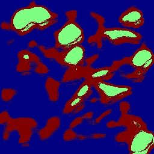

# MiniLabelNet-Count

## Original code implementation in PyTorch from the paper: [Refined Weakly Supervised Yield Estimation Through the MiniLabelNet-Count Framework](https://ieeexplore.ieee.org/document/10587272)

<div style="text-align:center; width:100%; height:100%">
  
  
  
  
  
</div>


- [Description](#description)
- [Requirements](#requirements)
- [Usage](#usage)
  - [Training](#training)
  - [Validation](#prediction)
  - [Inference](#inference)
- [Dataset](#data)

### Description


<div style="text-align:center; width:100%; height:100%">
  
</div>

For each input image _I<sub>i</sub>_ the optimization module, marked in yellow, computes the
final quartet of outputs from the network. Three local feature (_LF_) vectors, denoted as _F<sub>1/1</sub>_, _F<sub>1/2</sub>_, and _F<sub>1/4</sub>_, and a _GF_ vector represented by _F<sub>g</sub>_ . During the
training phase, the _LF_ vectors and the _GF_ vector are summed up and channeled into three discrete LTPA modules, identified as _F<sub>a1</sub>_, _F<sub>a2</sub>_, and _F<sub>a3</sub>_. The resulting
_GD_ vectors _G<sub>1/1</sub>_, _G<sub>1/2</sub>_, and _G<sub>1/4</sub>_ are concatenated (orange layer) to form the vector _V<sub>c</sub>_ that is finally inputted into the fully connected layer _F<sub>c</sub>_, which outputs the
classification score _$\hat{l}$<sub>i</sub>_. In the inference phase, _F<sub>g</sub>_ is multiplied by the compatibility score map _c<sub>1/1</sub>_, procured from the _F<sub>a1</sub>_ LTPA module. The resulting activation
maps are aggregated to create the heatmap.

### Requirements

1. [Install CUDA](https://developer.nvidia.com/cuda-downloads)

2. Install dependencies

```bash
pip install -r requirements.txt
```
**Note : Use Python 3.10 or newer**

### Usage
Set parameters on configs.yaml file

- data_roth: ../path/to/Dataset/
- log_path: ../path/to/ProjectRepository/runs/

#### Training 

Run script "apps/train.py" to train the model. 

- exp_name: create a new folder where checkpoint and results are saved

#### Validation

Run script "apps/validation.py" to find parameter $r$ and $th_P$ that provide best RMSE. Set range for grid search in config.yaml using:

- min_r: 
- max_r:
- step_r:
- min_thp:
- max_thp:
- step_thp: 

#### Inference

Run script "apps/inference.py". Set parameters $r$ amd $thp$ fund during validation for standard local maxima detection. To use TC-LMD, in config.yaml set:

- TC-LMD: True

### Dataset

Datasets should be in PascalVOC format, avoiding the 'Main' folder. 

    ├── Dataset Directory/
    │   └── Devkit/
    │       ├── NumericAnnotations/
    │       │   ├── validation.csv
    │       │   └── test.csv
    │       ├── BinaryAnnotations/
    │       │   ├── train.csv
    │       │   └── validation.csv
    │       ├── ImageSets/
    │       │   ├── train.txt
    │       │   ├── train.txt
    │       │   └── test.txt
    │       └── JPEGImages/


 while .csv files should be in the following format:
```
names,labels
sample_1_name,label
sample_2_name,label
sample_3_name,label
|
|
|
sample_n_name,label
```

with 'label' meaning the binary label (0 or 1) or the numeric label, i.e., the number of instances present in the related sample.


## Citing our work

If you find this code useful in your research, please consider citing us:

```
@ARTICLE{10587272,
  author={Denarda, Alessandro Rocco and Crocetti, Francesco and Brilli, Raffaele and Costante, Gabriele and Valigi, Paolo and Fravolini, Mario Luca},
  journal={IEEE Transactions on AgriFood Electronics}, 
  title={Refined Weakly Supervised Yield Estimation Through the MiniLabelNet-Count Framework}, 
  year={2024},
  volume={},
  number={},
  pages={1-9},
  keywords={Vectors;Heating systems;Training;Yield estimation;Task analysis;Optimization;Location awareness;Artificial intelligence in agriculture;computer vision (CV);deep learning;fruit detection},
  doi={10.1109/TAFE.2024.3419709}}
```
